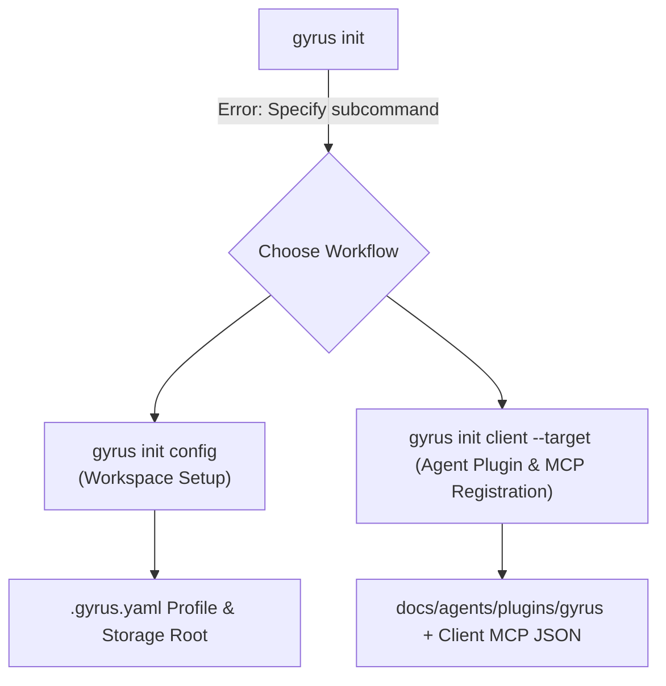

# Gyrus Installation & Workspace Initialization Guide

This guide covers installing the Gyrus CLI binary on your machine and initializing your workspace or user environment with custom configurations, Agent Plugins, and Model Context Protocol (MCP) server registrations.

---

## 📥 1. Installing the Gyrus CLI

Choose one of the following methods to install the `gyrus` executable into your system `$PATH`:

### Option A: One-Liner Installer Script (Recommended)
```bash
curl -sSL https://raw.githubusercontent.com/armckinney/gyrus/main/install.sh | bash
```
This automatically detects your OS (`linux`, `darwin`, `windows`) and architecture (`amd64`, `arm64`), downloads the latest binary release from GitHub, and places `gyrus` into `/usr/local/bin` (or `~/.local/bin`).

### Option B: Build from Source via `go install`
```bash
go install github.com/armckinney/gyrus/cmd/gyrus@latest
```

### Option C: Manual Binary Release Download
Download the pre-compiled binary tarball for your platform directly from [Gyrus GitHub Releases](https://github.com/armckinney/gyrus/releases/latest).

---

## 🚀 2. Two-Step Workspace Initialization

Gyrus cleanly decouples workspace repository configuration from client tool distribution using two explicit subcommands:



> [!IMPORTANT]
> Running bare `gyrus init` without a subcommand will exit with an error. Initialization must be performed explicitly via `gyrus init config` and/or `gyrus init client`.

---

## ⚙️ 3. Initializing Workspace Configuration (`gyrus init config`)

Bootstraps repository configuration and sets up the local or cloud persistence profile:

```bash
gyrus init config
```

### Flag Options

| Flag | Shorthand | Description | Default |
| :--- | :--- | :--- | :--- |
| `--profile` | `-p` | Configuration profile (`default`, `remote-git`, `remote-s3`, `remote-azure`, `remote-gcs`, `remote-postgres`). | `default` |
| `--owner-group` | `-o` | Default security owner group for documents. | `armckinney` |
| `--storage-path` | | Custom storage root directory. | `.gyrus/docs` |

### Storage Profile Options (`--profile`)

```bash
gyrus init config --profile default     # LocalFS Storage + SQLite FTS5
gyrus init config --profile remote-git  # Remote Git Repository Persistence
gyrus init config --profile remote-s3   # AWS S3 Bucket Storage
gyrus init config --profile remote-azure # Azure Blob Container Storage
gyrus init config --profile remote-gcs  # Google Cloud Storage Bucket
gyrus init config --profile remote-postgres # PostgreSQL Database Backend
```

### Required Cloud Storage Permissions
When using cloud object storage (`remote-s3`, `remote-azure`, `remote-gcs`), ensure your environment has appropriate data plane access:
- **AWS S3 (`remote-s3`):** IAM policy must grant `s3:GetObject`, `s3:PutObject`, `s3:DeleteObject`, and `s3:ListBucket`.
- **Azure Blob (`remote-azure`):** Azure identity must be assigned `Storage Blob Data Contributor` or `Storage Blob Data Owner`.
- **Google Cloud Storage (`remote-gcs`):** Service account must be assigned `roles/storage.objectAdmin` or `roles/storage.objectUser`.

---

## 🤖 4. Installing Agent Plugin & Registering MCP (`gyrus init client`)

Installs the packaged Gyrus Agent Plugin and registers the MCP server configuration for an explicit AI coding assistant:

```bash
gyrus init client --target antigravity
```

### Flag Options

| Flag | Shorthand | Description | Default |
| :--- | :--- | :--- | :--- |
| `--target` | `-t` | **Required.** Client target: `antigravity`, `claude`, `codex`, or `copilot`. | None |
| `--mode` | `-m` | Execution mode: `stdio` (local binary) or `docker` (containerized). | `stdio` |
| `--mcp-container-image` | | Docker container image tag for containerized mode. | `ghcr.io/armckinney/gyrus:latest` |
| `--global` | `-g` | Install into user home runtime path rather than repository workspace. | `false` |
| `--plugin-dir` | | Custom target directory for the extracted plugin bundle. | Derived per target |

> [!NOTE]
> The ambiguous `--target all` option has been eliminated to prevent accidental mutations across disparate agent configurations. Each target must be installed explicitly.

### Target Platform Mapping

| Platform Target | Flag Example | Generated Plugin Location | Registered MCP Config File |
| :--- | :--- | :--- | :--- |
| **Google Antigravity** | `gyrus init client -t antigravity` | `docs/agents/plugins/gyrus/` | `.antigravity/mcp.json` |
| **GitHub Copilot** | `gyrus init client -t copilot` | `docs/agents/plugins/gyrus/` | `.vscode/mcp.json` |
| **OpenAI Codex** | `gyrus init client -t codex` | `docs/agents/plugins/gyrus/` | `.codex/mcp.json` |
| **Claude Desktop / Code** | `gyrus init client -t claude` | *(MCP only)* | `.claude/mcp.json` (or `~/.config/Claude/claude_desktop_config.json` with `-g`) |

---

## 🔒 5. Safe Non-Destructive Config Merging

When updating client MCP configuration files (`.antigravity/mcp.json`, `.vscode/mcp.json`, etc.), Gyrus non-destructively parses existing JSON content and adds or updates only the `"gyrus"` server entry. All other pre-existing user servers (e.g. `sqlite`, `github`, `fetch`) remain completely untouched.
