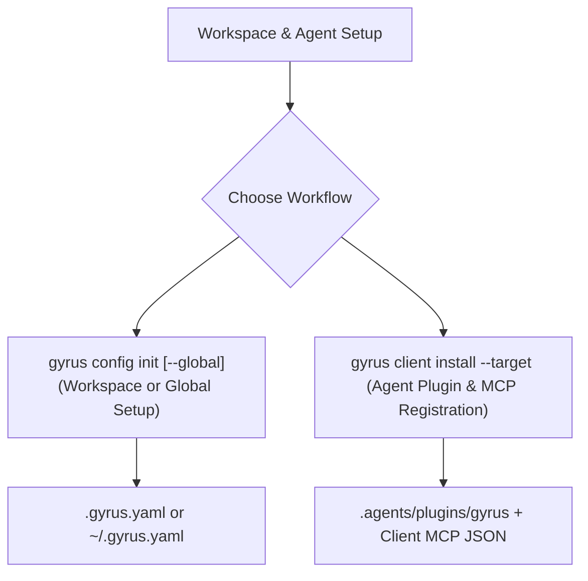

# Gyrus Installation & Workspace Initialization Guide

This guide covers installing the Gyrus CLI binary on your machine and initializing your workspace or user environment with custom configurations, Agent Plugins, and Model Context Protocol (MCP) server registrations.

---

## 📥 1. Installing the Gyrus CLI

Choose one of the following methods to install the `gyrus` executable into your system `$PATH`:

### Option A: One-Liner Installer Script (Recommended)
```bash
curl -sSL https://raw.githubusercontent.com/armckinney/gyrus/main/install.sh | bash
```
This automatically detects your OS (`linux`, `darwin`, `windows`) and architecture (`amd64`, `arm64`), downloads the latest binary release from GitHub, and places `gyrus` into `/usr/local/bin` (or `~/.local/bin`).

### Option B: Build from Source via `go install`
```bash
go install github.com/armckinney/gyrus/cmd/gyrus@latest
```

### Option C: Manual Binary Release Download
Download the pre-compiled binary tarball for your platform directly from [Gyrus GitHub Releases](https://github.com/armckinney/gyrus/releases/latest).

---

## 🚀 2. Two-Step Workspace Initialization

Gyrus cleanly decouples workspace repository configuration from client tool distribution using explicit subcommands:



---

## ⚙️ 3. Initializing Workspace & Global Configuration (`gyrus config init`)

Bootstraps repository or global configuration and sets up the local or cloud persistence profile:

```bash
# Initialize repository workspace configuration (.gyrus.yaml)
gyrus config init

# Or initialize user-wide global configuration (~/.gyrus.yaml)
gyrus config init --global
```

### Flag Options

| Flag | Shorthand | Description | Default |
| :--- | :--- | :--- | :--- |
| `--profile` | `-p` | Configuration profile (`local`, `git`, `blob`, `s3`, `azure`, `gcs`, `postgres`, `vector`). | `local` |
| `--owner-group` | `-o` | Default security owner group for documents. | `root` |
| `--global` | `-g` | Write user-wide configuration to `~/.gyrus.yaml`. | `false` |
| `--force` | `-f` | Overwrite existing configuration file without prompting. | `false` |

### Storage Profile Options (`--profile`)

```bash
gyrus config init --profile local     # LocalFS Storage + SQLite FTS5 (default)
gyrus config init --profile git       # Remote Git Repository Persistence
gyrus config init --profile s3        # AWS S3 Bucket Storage
gyrus config init --profile azure     # Azure Blob Container Storage
gyrus config init --profile gcs       # Google Cloud Storage Bucket
gyrus config init --profile blob      # Cloud Blob Storage
gyrus config init --profile postgres  # PostgreSQL Database Backend
gyrus config init --profile vector    # Semantic Vector Search Profile
```

### Required Cloud Storage Permissions
When using cloud object storage (`remote-s3`, `remote-azure`, `remote-gcs`), ensure your environment has appropriate data plane access:
- **AWS S3 (`remote-s3`):** IAM policy must grant `s3:GetObject`, `s3:PutObject`, `s3:DeleteObject`, and `s3:ListBucket`.
- **Azure Blob (`remote-azure`):** Azure identity must be assigned `Storage Blob Data Contributor` or `Storage Blob Data Owner`.
- **Google Cloud Storage (`remote-gcs`):** Service account must be assigned `roles/storage.objectAdmin` or `roles/storage.objectUser`.

---

## 🤖 4. Installing Agent Plugin & Registering MCP (`gyrus client install`)

Installs the packaged Gyrus Agent Plugin and registers the MCP server configuration for an explicit AI coding assistant:

```bash
gyrus client install --target antigravity
```

### Flag Options

| Flag | Shorthand | Description | Default |
| :--- | :--- | :--- | :--- |
| `--target` | `-t` | **Required.** Client target: `antigravity`, `claude`, `codex`, or `copilot`. | None |
| `--mode` | `-m` | Execution mode: `local` (local binary) or `container` (containerized Docker). | `local` |
| `--mcp-container-image` | | Docker container image tag for containerized mode. | `ghcr.io/armckinney/gyrus:latest` |
| `--global` | `-g` | Install into user home runtime path rather than repository workspace. | `false` |
| `--plugin-dir` | | Custom target directory for the extracted plugin bundle. | Derived per target |
| `--no-hooks` | | Skip installing agent lifecycle hooks in the plugin. | `false` |

### Target Platform Mapping

| Platform Target | Flag Example | Generated Plugin Location | Registered MCP Config File |
| :--- | :--- | :--- | :--- |
| **Google Antigravity** | `gyrus client install -t antigravity` | `.agents/plugins/gyrus/` *(Global: `~/.gemini/config/plugins/gyrus/`)* | Discovered directly from plugin `mcp_config.json` |
| **GitHub Copilot** | `gyrus client install -t copilot` | `.agents/plugins/gyrus/` | `.vscode/mcp.json` |
| **OpenAI Codex** | `gyrus client install -t codex` | `.agents/plugins/gyrus/` | `.codex/mcp.json` |
| **Claude Desktop / Code** | `gyrus client install -t claude` | `marketplace.json` / `.claude-plugin` | `.claude/mcp.json` (or `~/.config/Claude/claude_desktop_config.json` with `-g`) |

#### Direct Plugin Installation from GitHub Repository (Claude Code & OpenAI Codex)
You can install the Gyrus plugin directly from this GitHub repository into Claude Code or OpenAI Codex using their native Git marketplace discovery without manual cloning:

```bash
# Claude Code
claude plugin marketplace add armckinney/gyrus
claude plugin install gyrus@gyrus

# OpenAI Codex CLI
codex plugin marketplace add armckinney/gyrus
codex plugin install gyrus@gyrus
```

## 🎛️ 5. Configuring & Enabling/Disabling Agent Automation & Hooks

Gyrus installs lifecycle hooks (`PreInvocation` and `Stop`) into the Agent Plugin bundle to automate context retrieval and encourage documentation compliance without nagging on routine code changes.

You can configure, enable, or disable this functionality at multiple levels:

### 1. In Workspace Configuration (`.gyrus.yaml`)
To customize or disable hooks for your repository, add the `automation` block:

```yaml
automation:
  hooks_enabled: true         # Master switch (set to false to disable all hooks)
  auto_context: true          # Inject high-level context before agent reasoning
  architectural_check: true   # Prompt agent on stop if architectural contracts change
  ignored_paths:              # Files and directories ignored during checks
    - "tests/**"
    - "*_test.go"
    - "*.lock"
    - "vendor/**"
    - "node_modules/**"
```

### 2. Temporary Shell Override (Environment Variable)
To temporarily disable all hook execution without modifying configuration:
```bash
export GYRUS_HOOKS_ENABLED=false
```

### 3. Installation Without Hooks
To install the plugin bundle without generating `hooks.json`:
```bash
gyrus client install --target antigravity --no-hooks
```


---

## 🔒 5. Safe Non-Destructive Config Merging

When updating client MCP configuration files (`.vscode/mcp.json`, `.codex/mcp.json`, etc.), Gyrus non-destructively parses existing JSON content and adds or updates only the `"gyrus"` server entry. All other pre-existing user servers (e.g. `sqlite`, `github`, `fetch`) remain completely untouched.
