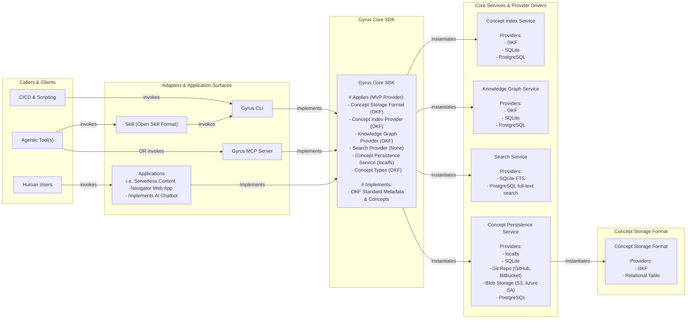

# Gyrus: Unified Context & Memory Engine

> **The Context Control Plane for Software Development Teams & AI Agents.**
> A shared, governed layer to discover, resolve, create, maintain, and distribute engineering context across humans, AI tools, repositories, and documentation systems.

---

## 🌟 Overview & Value Proposition

**Gyrus** is an open-source **Context Control Plane** and knowledge graph designed to bridge the gap between human engineering teams and AI coding assistants (such as Cursor, Claude Code, GitHub Copilot, and custom agents). Built in Go, Gyrus organizes codebase context, Architecture Design Records (ADRs), specifications, PRDs, runbooks, and guidelines using the **Open Knowledge Format (OKF)** standard.

Rather than replacing your existing tools or forcing a migration to a proprietary cloud platform, Gyrus coordinates your existing infrastructure—Git repositories, documentation platforms (e.g. Confluence), local filesystems, search engines, and vector databases—under a single, provider-neutral context model.

---

### 🌐 What Gyrus Is

* **A Shared Context Layer:** Enables developers and AI agents to work from the same trusted body of architectural, operational, and implementation knowledge.
* **A Common Interface Across Agentic Tools:** Exposes a unified API surface across CLI, stdio MCP server, Open Skill Format skills, `AGENTS.md`, and custom agent pipelines.
* **A Context Resolution Engine:** Determines what information is *applicable, current, authoritative, and required* for a specific task within token budgets, moving far beyond simple keyword search.
* **A Governed Knowledge Creation Framework:** Provides a structured promotion lifecycle (`Observation` ➔ `Candidate Memory` ➔ `Proposed Artifact` ➔ `Published Knowledge`) so AI agents propose knowledge rather than silently redefining organizational truth.
* **A Portable Artifact System:** Keeps canonical knowledge human-readable (Markdown + YAML frontmatter contracts) so context travels with code across dev containers, CI/CD pipelines, and offline environments.

---

### 🛑 What Gyrus Is Not

* **Not a replacement for Git, Confluence, or documentation platforms** — Gyrus coordinates and materializes context across them.
* **Not a coding agent or agent orchestration framework** — Gyrus provides the governed context layer that any coding or research agent consumes.
* **Not a proprietary vector database or locked-in wiki** — Gyrus uses search indexes, vector embeddings, and knowledge graphs as derived projections while canonical Markdown artifacts remain the source of truth.
* **Not a replacement for MCP or Agent Skills** — Gyrus leverages MCP and Agent Skills as runtime transport and behavioral integration adapters.

---

## 🎯 Core Engineering Pillars

1. 📄 **Concept Data Contracts (OKF):** Validates structured software contracts (`adr`, `prd`, `specification`, `guide`, `standards`, `glossary`, `improvement-proposal`, `release-note`) rather than unstructured text dumps.
2. 🕸️ **Knowledge Graph & Edge Indexing:** Traverses explicit directional links (`depends_on`, `supersedes`, `implements`, `mitigates`) for deep architectural context.
3. 🧩 **Composable Service Providers:** Runs locally (`localfs` + embedded SQLite FTS5) or scales to enterprise cloud backends (Git repos, AWS S3, Azure SA, PostgreSQL).
4. 🌐 **Unified Memory Persistence:** Operates as a single source of truth across CLI tools (`gyrus`), MCP stdio servers, agent skills, and web dashboards.
5. 📦 **Composable Core SDK (`pkg/gyrus`):** Embeds a zero-dependency Go engine directly into custom AI pipelines, CLI tools, and background workers.
6. 🎯 **Token-Budgeted Context Resolution (`gyrus suggest-context`):** Synthesizes high-signal, non-redundant context within prompt token limits.
7. 🔄 **State Machine & Immutability Governance:** Enforces validated document lifecycle state transitions (e.g. `proposed` ➔ `accepted`) and runtime content immutability for decision logs (`immutable: true`).
8. 🚀 **Embedded Templates (`go:embed`) & Custom Overrides:** Ships 11 pre-packaged Markdown schema templates with `.gyrus.yaml` override support.

---

## 📊 Market & Solution Comparison

| Solution Category | Strengths | Gaps | 🌌 **Gyrus Context Control Plane Value** |
| :--- | :--- | :--- | :--- |
| **Agent Skills** *(e.g. `.cursorrules`, `SKILL.md`)* | Portable instructions & zero-latency local prompt hints | Cannot provide shared state, authority, lifecycle, or multi-agent enforcement | Adds durable context persistence, schema validation, task resolution, and state machine governance |
| **Documentation Platforms & MCPs** *(e.g. Confluence)* | Human-readable pages, search, permissions, & rich wiki collaboration | Provider-specific, page-centric, lacks repository scoping & engineering contract schemas | Adds a provider-independent artifact model, contract validation, and task-specific context resolution |
| **Skills + Documentation MCP** | Low-cost way to guide agents toward structured docs | Relies on each agent to consistently follow instructions; high prompt token bloat | Converts recommended agent behavior into an enforceable Go core engine & single-source MCP |
| **Agent Memory Platforms** *(e.g. Mem0)* | Persistent facts, session memories, and user state | Optimized for individual agents rather than shared, governed, human-readable knowledge | Preserves coherent Markdown artifacts and separates temporary memory from trusted knowledge |
| **Repository-Local Files** | Version-controlled, portable, close to the code | Limited global discovery, cross-repository reuse, & central governance | Combines local repository ownership with global context inheritance and unified indexing |
| **Vector DBs & RAG Frameworks** *(e.g. Pinecone, Chroma)* | High-dimensional semantic similarity search | Raw text chunks lack contract boundaries, explicit edges (`depends_on`), or state governance | Uses search/vector/graph DBs as replaceable derived indexes beneath a governed context model |
| **Gyrus Context Engine** | **Shared, governed, portable context across humans & heterogeneous AI agents** | *Complements existing tools rather than replacing them* | **Provides canonical OKF contracts, context resolution, provider neutrality, & zero-infra local/cloud scale** |

> 📖 *For a complete strategic comparison and deep-dive market analysis, see the official PRD: [Gyrus Product Value Proposition & Strategic Positioning](docs/.gyrus/docs/okf/armckinney/reference/prd-002-value-proposition-positioning.md).*

---

## 🏛️ High-Level System Architecture



---

## 🚀 Getting Started

### 1. Installation

Install the pre-compiled `gyrus` binary automatically across Linux, macOS, and Windows (Git Bash/WSL):

```bash
curl -sSL https://raw.githubusercontent.com/armckinney/gyrus/main/install.sh | bash
```

*Alternatively, build from source using Go 1.25+:*

```bash
git clone https://github.com/armckinney/gyrus.git
cd gyrus
make build
```

This compiles the standalone `gyrus` executable into the workspace root.

### 2. Initialize Gyrus Storage

Initialize Gyrus in your repository workspace:

```bash
./gyrus init
```

By default, Gyrus resolves storage path hierarchy in the following order:
1. `--storage-path` CLI flag
2. `GYRUS_STORAGE_PATH` environment variable
3. `.gyrus.yaml` / `.gyrus/config.yaml` local config file
4. `~/.config/gyrus/config.yaml` user config file
5. `~/.gyrus/` default application directory

### 3. Create your first OKF Document

Create an Architecture Design Record (ADR):

```bash
./gyrus create \
  --id "adr-001-storage-engine" \
  --title "Use Embedded SQLite FTS5 for Gyrus Search" \
  --category "architecture" \
  --type "adr" \
  --owner-group "platform" \
  --content "We choose CGO-free SQLite FTS5 for zero-dependency local keyword search."
```

### 4. Search and Suggest Context

Search across your contract documents:

```bash
./gyrus search --query "SQLite search"
```

Suggest linearized context matching an agent prompt:

```bash
./gyrus suggest-context --prompt "How is local search implemented in Gyrus?"
```

---

## 📚 Documentation Sitemap

- 🏛️ **[System Architecture](docs/.gyrus/docs/okf/armckinney/reference/guide-001-system-architecture.md):** Complete guide to the Gyrus Core SDK, Provider Framework, OKF directory topology, and state machines.
- ⚙️ **[Configuration Reference](docs/.gyrus/docs/okf/armckinney/reference/tech-ref-002-config-schema.md):** Comprehensive reference for all `.gyrus.yaml` options, profiles, and path precedence.
- 🛠️ **[CLI Reference Manual](docs/.gyrus/docs/okf/armckinney/reference/tech-ref-001-cli-manual.md):** Detailed argument and flag reference for all 11 `gyrus` CLI subcommands and exit codes.
- 🔌 **[MCP Server Setup Guide](docs/.gyrus/docs/okf/armckinney/reference/guide-004-mcp-server-setup.md):** Native and Docker containerized MCP stdio server setup for Cursor, Claude Desktop, and VS Code.
- 🤖 **[Agent Skills Setup Guide](docs/.gyrus/docs/okf/armckinney/reference/guide-003-agent-skills-setup.md):** Instructions for copying `.agents/skills/gyrus/SKILL.md` into code repositories for Claude Code and terminal agents.
- 📑 **[Value Proposition & Strategic Positioning PRD](docs/.gyrus/docs/okf/armckinney/reference/prd-002-value-proposition-positioning.md):** Comprehensive market-wide strategic comparison PRD of Gyrus vs enterprise context engines, vector DBs, memory platforms, and agent skills.
- 📋 **[Specification Implementation Roadmap](docs/.gyrus/docs/okf/armckinney/reference/prd-001-specification-roadmap.md):** Master roadmap across Phase 1 MVP, Phase 2 Version 1.0, and Phase 3 Future Extensions.
