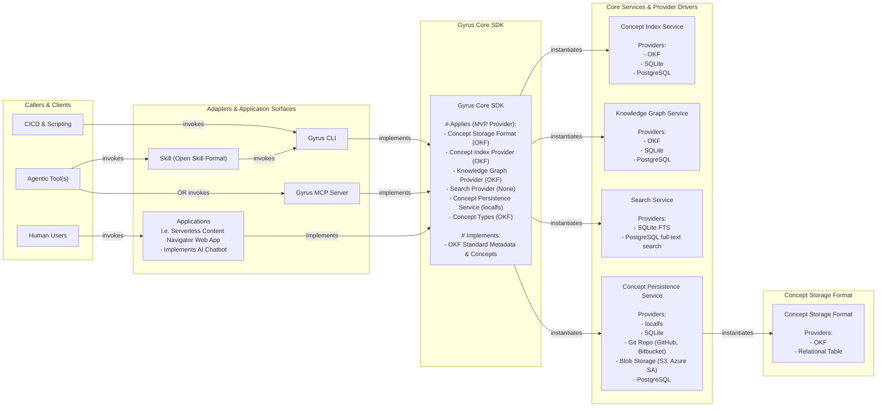

# Gyrus: Unified Context & Memory Engine

> High-performance context management engine and knowledge graph for software development teams and AI agents.

---

## 🌟 Overview & Value Proposition

**Gyrus** is an open-source context management engine and knowledge graph designed to bridge the gap between human engineering teams and AI coding assistants. Built in Go, Gyrus organizes codebase context, Architecture Design Records (ADRs), specifications, PRDs, and guidelines using the **Open Knowledge Format (OKF)** standard.

Gyrus delivers provider-agnostic search (i.e. embedded SQLite FTS5 or cloud search backends), incremental filesystem and cloud synchronization, document state-machine validation, a standalone CLI (`gyrus`), and an embedded Model Context Protocol (MCP) server for GUI IDEs (i.e. Cursor, Claude Desktop, Copilot).

---

### 🎯 Why Gyrus?

Gyrus is an active **Context Engine** built around 8 core engineering pillars:

1. 📄 **Concept Data Contracts (OKF):** Validates structured software contracts (`adr`, `prd`, `spec`) rather than unstructured text dumps.
2. 🕸️ **Knowledge Graph Indexing:** Traverses explicit directional links (`depends_on`, `implements`) for deep architectural context.
3. 🧩 **Composable Service Providers:** Runs locally (`localfs` + SQLite FTS5) or scales to enterprise cloud backends (Git repos, S3, Postgres).
4. 🌐 **Unified Memory Persistence:** Operates as a single source of truth across CLI, MCP stdio servers, agent skills, and web apps.
5. 📦 **Composable Core SDK (`pkg/gyrus`):** Embeds zero-dependency Go engine directly into custom AI pipelines and internal CLI tools.
6. 🎯 **Token-Budgeted Context Linearization:** Synthesizes high-signal, non-redundant context within prompt token limits (`gyrus suggest-context`).
7. 🔄 **State Machine Governance:** Enforces validated document lifecycle state transitions (i.e. `proposed` ➔ `accepted`).
8. 🚀 **Embedded Templates (`go:embed`):** Ships 11 pre-packaged Markdown schema templates with `.gyrus.yaml` override support.

---

### 📊 Objective Capability & Feature Comparison Matrix

| Feature / Dimension | Raw Agent Skills *(i.e. `.cursorrules`)* | Generic Doc MCPs *(i.e. Confluence)* | Vector DBs / RAG *(i.e. Pinecone)* | 🌌 **Gyrus Context Engine** |
| :--- | :--- | :--- | :--- | :--- |
| **Primary Strength** | Local IDE Zero-Latency | Collaborative Wiki Pages | Semantic Similarity Search | **Structured Contract Framework (OKF)** |
| **Structured Data Contracts (OKF)** | ❌ None | ❌ Unstructured Pages | ❌ Raw Text Chunks | **✅ Enforced ADR/PRD/Spec Schemas** |
| **Knowledge Graph & Dependencies** | ❌ None | ⚠️ Loose Page Tree | ⚠️ Implicit Vector Distance | **✅ Explicit Edge Graph (`depends_on`, `implements`)** |
| **State Machine Governance** | ❌ None | ❌ None | ❌ None | **✅ Validated Transitions (`proposed` ➔ `accepted`)** |
| **Token-Budgeted Linearization** | ❌ Manual Prompt Bloat | ❌ Unbounded Payload | ⚠️ Top-K Text Chunks | **✅ Budgeted Linearizer (`suggest-context`)** |
| **Infrastructure Deployment** | **✅ Local Text Files** | ❌ SaaS Cloud Only | ❌ DB Cluster Only | **✅ Optional Zero-Infra Local or Cloud** |

> 📖 *For a complete strategic comparison and deep-dive analysis, see the official PRD: [Gyrus Product Value Proposition & Strategic Positioning](docs/.gyrus/docs/okf/armckinney/reference/prd-002-value-proposition-positioning.md).*

---

## 🏛️ High-Level System Architecture



---

## 🚀 Getting Started

### 1. Installation

Install the pre-compiled `gyrus` binary automatically across Linux, macOS, and Windows (Git Bash/WSL):

```bash
curl -sSL https://raw.githubusercontent.com/armckinney/gyrus/main/install.sh | bash
```

*Alternatively, build from source using Go 1.25+:*

```bash
git clone https://github.com/armckinney/gyrus.git
cd gyrus
make build
```

This compiles the standalone `gyrus` executable into the workspace root.

### 2. Initialize Gyrus Storage

Initialize Gyrus in your repository workspace:

```bash
./gyrus init
```

By default, Gyrus resolves storage path hierarchy in the following order:
1. `--storage-path` CLI flag
2. `GYRUS_STORAGE_PATH` environment variable
3. `.gyrus.yaml` / `.gyrus/config.yaml` local config file
4. `~/.config/gyrus/config.yaml` user config file
5. `~/.gyrus/` default application directory

### 3. Create your first OKF Document

Create an Architecture Design Record (ADR):

```bash
./gyrus create \
  --id "adr-001-storage-engine" \
  --title "Use Embedded SQLite FTS5 for Gyrus Search" \
  --category "architecture" \
  --type "adr" \
  --owner-group "platform" \
  --content "We choose CGO-free SQLite FTS5 for zero-dependency local keyword search."
```

### 4. Search and Suggest Context

Search across your contract documents:

```bash
./gyrus search --query "SQLite search"
```

Suggest linearized context matching an agent prompt:

```bash
./gyrus suggest-context --prompt "How is local search implemented in Gyrus?"
```

---

## 📚 Documentation Sitemap

- 🏛️ **[System Architecture](docs/.gyrus/docs/okf/armckinney/reference/guide-001-system-architecture.md):** Complete guide to the Gyrus Core SDK, Provider Framework, OKF directory topology, and state machines.
- ⚙️ **[Configuration Reference](docs/.gyrus/docs/okf/armckinney/reference/tech-ref-002-config-schema.md):** Comprehensive reference for all `.gyrus.yaml` options, profiles, and path precedence.
- 🛠️ **[CLI Reference Manual](docs/.gyrus/docs/okf/armckinney/reference/tech-ref-001-cli-manual.md):** Detailed argument and flag reference for all 11 `gyrus` CLI subcommands and exit codes.
- 🔌 **[MCP Server Setup Guide](docs/.gyrus/docs/okf/armckinney/reference/guide-004-mcp-server-setup.md):** Native and Docker containerized MCP stdio server setup for Cursor, Claude Desktop, and VS Code.
- 🤖 **[Agent Skills Setup Guide](docs/.gyrus/docs/okf/armckinney/reference/guide-003-agent-skills-setup.md):** Instructions for copying `.agents/skills/gyrus/SKILL.md` into code repositories for Claude Code and terminal agents.
- 📑 **[Value Proposition & Strategic Positioning PRD](docs/.gyrus/docs/okf/armckinney/reference/prd-002-value-proposition-positioning.md):** Deep-dive comparison PRD of Gyrus vs raw agent skills, doc MCPs, vector DBs, and combination approaches.
- 📋 **[Specification Implementation Roadmap](docs/.gyrus/docs/okf/armckinney/reference/prd-001-specification-roadmap.md):** Remaining planned feature roadmap including cloud providers, PostgreSQL, vector search, and web dashboard.
