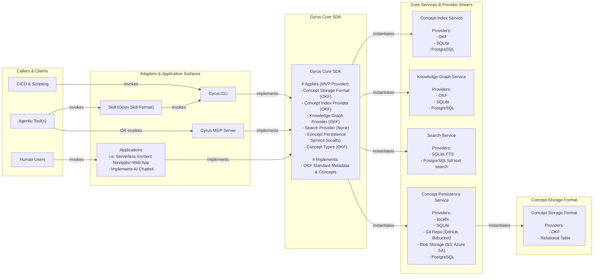
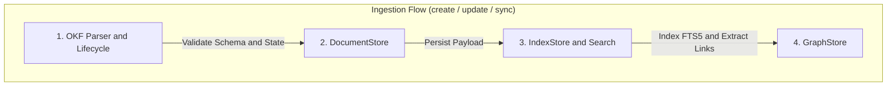
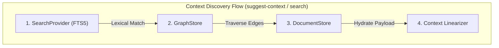

# Gyrus System Architecture

This document details the architectural design, provider abstractions, filesystem layout, and state machine lifecycle engines of **Gyrus: Unified Context & Memory Engine**.

---

## 1. System Blueprint & Component Topology

Gyrus is architected as a modular single Go binary delivering four primary runtime layers:



### 🔄 Core SDK Subsystem Execution Flows




---

## 2. Core Components

### A. Core SDK (`pkg/gyrus`)
The public domain package exposing:
- `Document`: Struct holding OKF metadata fields (`id`, `title`, `category`, `type`, `format`, `owner_group`, `version`, `status`, `last_modified_by`, `last_updated`, `tags`, `dependencies`) and Markdown body content.
- `DocumentStore`: Interface for CRUD document operations.
- `IndexStore`: Interface for metadata indexing and search retrieval.
- `GraphStore`: Interface for document relationship edges (`depends_on`, `supersedes`, `implements`, `mitigates`).
- `SearchProvider`: Interface for full-text lexical and metadata filtering.

### B. Storage & Index Providers (`internal/provider`)
- **`localfs`:** Handles atomic file operations over local filesystem storage directories.
- **`sqlite`:** Uses `modernc.org/sqlite` (pure Go, CGO-free) to manage SQLite DDL migrations (`documents_index`, `documents_fts`, `document_edges`), FTS5 lexical queries, and edge traversals.

### C. Open Knowledge Format (OKF) Parser (`internal/okf`)
Extracts YAML frontmatter headers from Markdown files, enforces schema validation rules (such as ID regex `^[a-z0-9-_]+$`), and serializes documents back to Markdown.

### D. Lifecycle State Machine Engine (`internal/lifecycle`)
Enforces valid state transitions:
- **ADR (`adr`):** `proposed` ➔ `accepted` ➔ `superseded` / `deprecated`
- **Improvement Proposal (`improvement-proposal`):** `draft` ➔ `reviewing` ➔ `approved` ➔ `implemented`
- **General Documents (`prd`, `guide`, `specification`, etc.):** `draft` ➔ `active` ➔ `deprecated` ➔ `archived`

---

## 3. OKF Bundle Directory Topology

When storing documents locally, Gyrus arranges files into a structured directory hierarchy under the storage root:

```text
<storage-root>/
├── config.yaml
├── index.db
└── okf/
    └── <owner_group>/ (Security boundary)
          ├── reference/ (Global ref docs: ADRs, Standards, Specs)
          │     ├── adr-001-storage.md
          │     └── spec-002-schema.md
          └── workspaces/<repo-x>/ (Repo-scoped context)
                └── prd-003-context-engine.md
```

---

## 4. Storage Path Precedence Hierarchy

Gyrus resolves its root storage location in the following order of precedence:

1. **`--storage-path <path>`** CLI flag argument.
2. **`GYRUS_STORAGE_PATH`** environment variable.
3. **Repository Project Config File:** `.gyrus.yaml`, `.gyrus.yml`, `.gyrus/config.yaml`, or `.gyrus/config.yml` in current working directory or any parent repository directory.
4. **User Home Config File:** `~/.config/gyrus/config.yaml`, `~/.config/gyrus/config.yml`, `~/.gyrus.yaml`, or `~/.gyrus.yml`.
5. **`~/.gyrus/`** default application directory.
