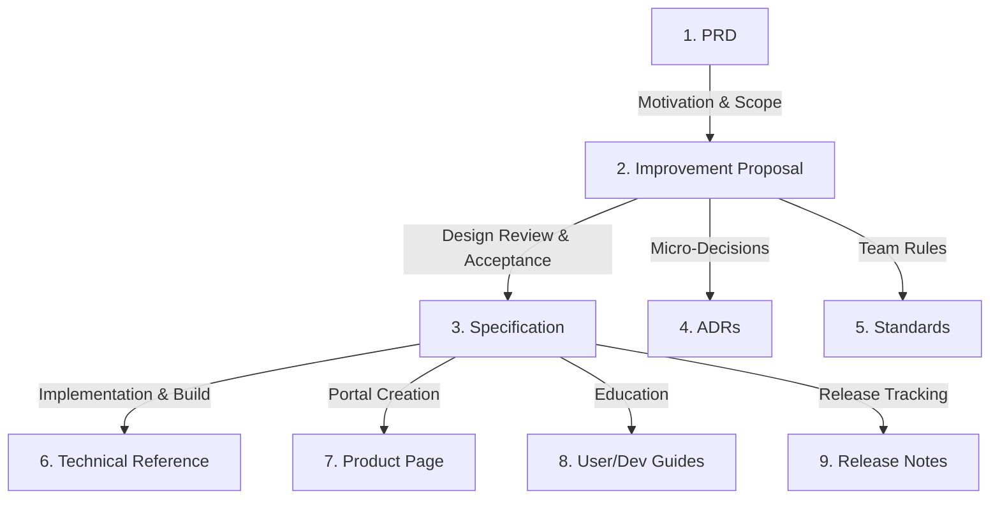
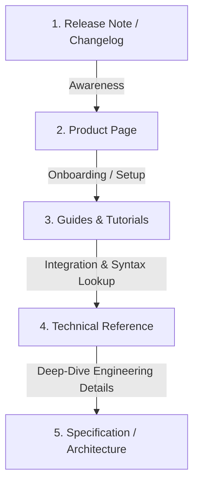

---
id: documentation-strategy
title: Wiki & Documentation Strategy
category: technical
type: standards
format: markdown
owner_group: engineering
version: 1
status: active
last_modified_by: <author-username>
last_updated: YYYY-MM-DD
tags: [documentation, strategy, sdlc, gyrus]
dependencies: [01_contract_schema, 04_core_engine]
---

# Wiki & Documentation Strategy

This document outlines the organization, lifecycles, and formatting strategies for the Gyrus context library. It details how documentation is created and consumed across the software development lifecycle (SDLC) from both developer and user perspectives.

---

## 1. Core Documentation Principles

1. **Treat Context as Code:** Changes to system specifications, database setups, and product rules are as critical as codebase changes.
2. **Never Let Context Decay:** When code changes invalidate documentation, the corresponding wiki files must be updated in the same workflow.
3. **Optimized for Humans & Agents:** Documents must remain highly structured, using frontmatter envelopes for machine processing and clean markdown for human readability.

---

## 2. Documentation Lifecycles

Documentation follows two distinct lifecycles depending on who is consuming or creating it.

### 2.1 The Internal Development (SDLC) Flow
This is the chronological order in which documentation is generated and consumed by product managers, engineers, and reviewers during a feature's development:

1. **Requirements (`prd`)**: Product managers detail the business case, success metrics, and user stories.
2. **Design (`improvement-proposal`)**: Engineers outline design alternatives, technical structures, testing plans, and system quality aspects.
3. **蓝图 (Specs/Decisions/Standards)**: Upon design approval:
   * **`specification`**: Holds final system architecture topologies, contracts, and data rules.
   * **`adr`**: Short audit records of micro-decisions (e.g. choice of storage engine).
   * **`standards`**: Establishes process-centric guidelines (e.g. Git workflows).
4. **Interface & Usage (`technical-reference` / `product` / `guide`)**:
   * **`technical-reference`**: Detailed lookup maps (APIs, CLI syntax, config parameters, and technical FAQs).
   * **`product`**: The main homepage portal summarizing the product and linking resources.
   * **`guide`**: Quickstart tutorials and runbooks.
5. **Release (`release-note`)**: Announce updates and trace version changes.

---

### 2.2 The User Story Flow (Discovery & Consumption)
This flow maps how consumers and developers discover, learn, and integrate with a product:

1. **Awareness (`release-note`)**: The user discovers a new release or update.
2. **Discovery (`product`)**: The user visits the Product Page to learn its benefits and value.
3. **Onboarding (`guide`)**: The user follows quickstarts or tutorials to configure their setup.
4. **Integration (`technical-reference`)**: The user looks up specific API endpoints, parameters, and commands to write their integration code.
5. **Deep-Dive (`specification` / `adr`)**: (Optional) The user reads the underlying technical specifications to understand constraints and design choices.

---

## 3. Document Types Directory

Below is the directory of all supported document types, their templates, owners, and purposes:

| Type | Template Link | Primary Owner | Target Audience | Key Question Answered / Purpose |
| :--- | :--- | :--- | :--- | :--- |
| **`prd`** | [prd.md](file:///Users/armck/git/wiki/docs/types/prd.md) | Product Manager | Engineers / QA | *What* features are we building and *why*? Stores business goals and user stories. |
| **`improvement-proposal`** | [improvement-proposal.md](file:///Users/armck/git/wiki/docs/types/improvement-proposal.md) | Lead Engineer | Team / Reviewers | *How* do we solve the design problem? Details solutions, limitations, and testing plans. |
| **`specification`** | [specification.md](file:///Users/armck/git/wiki/docs/types/specification.md) | Architect / Lead | Team / Consumers | What are the final system blueprints, data structures, and protocols? |
| **`adr`** | [adr.md](file:///Users/armck/git/wiki/docs/types/adr.md) | Team Engineers | Future Developers | Why did we make this micro-decision? (Immutable log of key choices). |
| **`technical-reference`** | [technical-reference.md](file:///Users/armck/git/wiki/docs/types/technical-reference.md) | Team Engineers | Integrators / Devs | What are the API endpoints, CLI syntax, and configurations? (Includes FAQs). |
| **`product`** | [product.md](file:///Users/armck/git/wiki/docs/types/product.md) | Product Lead | All Consumers | What is this product, its value, and how do I navigate its docs? |
| **`guide`** | [guide.md](file:///Users/armck/git/wiki/docs/types/guide.md) | Support / Engs | Operations / Devs | How do I onboard, setup, or troubleshoot this system? |
| **`standards`** | [standards.md](file:///Users/armck/git/wiki/docs/types/standards.md) | Tech Leads | All Engineers | What process guidelines, linting rules, and style policies must we follow? |
| **`glossary`** | [glossary.md](file:///Users/armck/git/wiki/docs/types/glossary.md) | Tech / PM Leads | All Developers | What do specific **terms** and vocabulary mean in this domain? |
| **`release-note`** | [release-note.md](file:///Users/armck/git/wiki/docs/types/release-note.md) | Product / Release | All Consumers | What changed in this version? (Features, fixes, and migration guides). |
| **`freeform`** | [freeform.md](file:///Users/armck/git/wiki/docs/types/freeform.md) | Anyone | Anyone | Catch-all container for unstructured notes, logs, or brainstorming. |

---

## 4. Enforcement & Validation

To prevent formatting decays and broken links, Gyrus validates documents during ingestion:
1. **Schema Check:** Verifies that the YAML frontmatter contains required fields (`id`, `title`, `category`, `type`, `status`, etc.).
2. **Lifecycle Check:** Validates that status updates follow legal transitions (e.g. an ADR cannot go from `superseded` back to `proposed`).
3. **Relationship Mapping:** Analyzes references (like `depends_on` or `implements`) to build the SQLite edge index for graph traversals.
