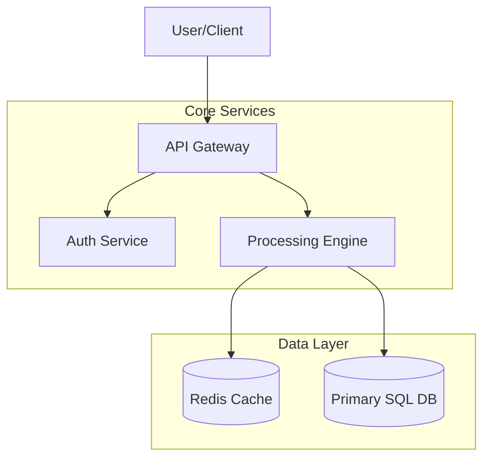

# Specification: [System / Component / Protocol Name]

## 1. Executive Summary

* **Lead Engineer:** [TODO]
* **Target Environment:** [TODO]
* **Last Audited:** [TODO: Date/None]

### Overview
[TODO: Provide a brief summary of the specification, its purpose, and the major components or systems it defines.]

---

## 2. System Architecture & Topology (If Applicable)

### High-Level Block Diagram
[TODO: Provide a visual representation of system layout (Mermaid, block diagram, or flowchart).]

### Subsystems & Interfaces
* **Subsystem A:** [TODO: Purpose, technology, responsibility, and interfaces]
* **Subsystem B:** [TODO: Purpose, technology, responsibility, and interfaces]

---

## 3. Core Design Decisions & Trade-offs

* **Pattern/Style:** [TODO: E.g., Microservices, Event-driven architecture, Modular Monolith]
* **Trade-off Analysis:**
  * **Option A:** [TODO: Pros / Cons]
  * **Option B:** [TODO: Pros / Cons]
  * **Selected Option:** [TODO: Justification]

---

## 4. Cross-Cutting Concerns & Technical Rules

* **Security & Network Boundaries:** [TODO: Detail firewall rules, VPC setups, encryption in-transit/at-rest, identity validation.]
* **Scale & Resiliency:** [TODO: High Availability, replication factors, horizontal autoscaling thresholds, disaster recovery strategy.]
* **Data Flow & Consistency:** [TODO: Eventual consistency vs. strong transaction consistency paths.]
